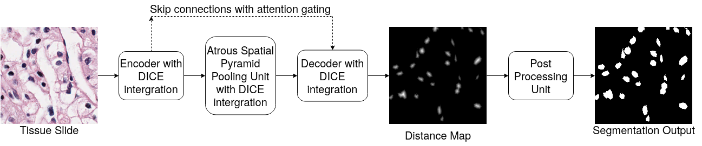

# Kidney-Segnet
Implementation of Kidney-Segnet: Efficient deep learning architecture with dimension-wise pyramid pooling for nuclei segmentation of histopathology images 



## Description
Image segmentation is a well explored task in the computer vision domain. However, the standard convolution operations performed in CNNs are inefficient in memory and computation. We address this issue by using dimension-wise convolutions (DiCE blocks) in an attention based encoder-decoder framework to make our network more efficient and effective. Moreover, in order to capture multi-scale information effectively, we use DiCE based atrous spatial pyramid pooling (ASPP) on dense feature maps in the encoder-decoder framework. 

## Getting Started

### Dependencies
* Python >= 3.6
* Pytorch == 1.9


### Installing
```
  git clone https://github.com/Aaatresh/kidney-segnet
```

### Data
The data this network was trained on H&E stained histopathology images of kidney and breast tissue. The kidney and breast datasets were obtained from [Crowdsourcing image
annotation for nucleus detection and segmentation in computational pathology: Evaluating experts, automated methods, and
the crowd][1] and [Segmentation of Nuclei in Histopathology Images by Deep Regression of the Distance Map][2] respectively.

### Running the Code
Jupyter Notebook or Google Colab can be used to open this notebook. Make sure you clone this repository before opening the notebook and running its cells. 


## Authors

Contributors names and contact info:
* Anirudh Aatresh (aaatresh@umich.edu)
* Dr. Shyam Lal (shyamfec@nitk.edu.in)

## Version History

* 0.1
    * Initial Release

## License

This project is licensed under the BSD-3-Clause License - see the LICENSE.md file for details


[1]: <https://www.researchgate.net/publication/266968190_CROWDSOURCING_IMAGE_ANNOTATION_FOR_NUCLEUS_DETECTION_AND_SEGMENTATION_IN_COMPUTATIONAL_PATHOLOGY_EVALUATING_EXPERTS_AUTOMATED_METHODS_AND_THE_CROWD>
[2]: <https://ieeexplore.ieee.org/document/8438559>

